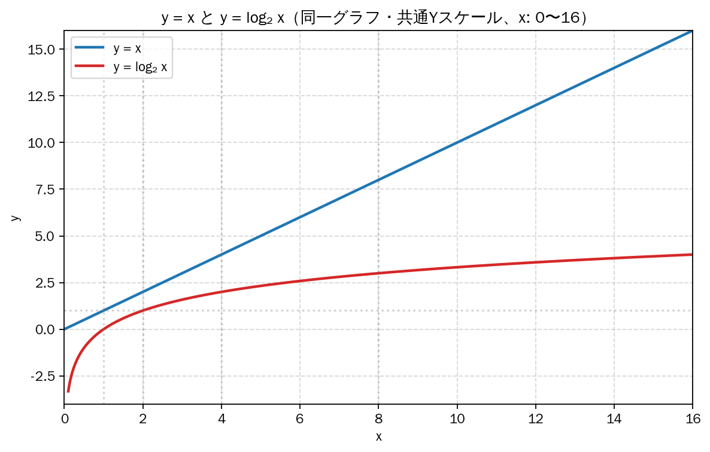

# アルゴリズムの計算量

一般的に、$n$ 個の要素からなるリストでは、最悪の場合、

* 線形探索法では、$n$ ステップが必要になります
* 二分探索法では$log_2 n$ ステップが必要になります

***

**対数**

いきなり『$log_2 n$』という表記が出てきて戸惑ったでしょうか？ これは **対数** （たいすう）です。

対数が何であるかは忘れてしまったかもしれませんが、指数（しすう）なら覚えている人もいるのではないでしょうか。

指数とは、一言でいうと **「同じ数字を何回掛け算するかけるか」を表す省略記法** のことです。例えば、「2 を3 回かける」という計算を普通に書くとこうなります。

$2 \times 2 \times 2 = 8$

これを指数を使って書くと、右上に小さく数字を乗せて、次のようにスッキリ表現できます。

$2^3 = 8$

これが指数です。そして、**対数は指数をひっくり返したもの** です。

$log_{10} 100$ は、「10 を何回掛けると100 になるか」と質問するようなものです。$10^2$(つまり $10 \times 10 = 100$)ですから，その質問の答えは、$2$ です。よって、$log_{10} 100 = 2$ となります。

|指数|それをひっくり返した対数|
|--:|--:|
|$10^2 = 100$|$log_{10} {100} = 2$|
|$10^3 = 1000$|$log_{10} {1000} = 3$|
|$2^3 = 8$|$log_2 8 = 3$|
|$2^4 = 16$|$log_2 {16} = 4$|
|$2^5 = 32$|$log_2 {32} = 5$|

***

さてさて、対数の説明が終わったところで、あらためて前掲の **『最悪の場合、二分探索では$log_2 n$ ステップが必要になります』** という文について、確認してみましょう。

要素が8 個のリストでは、$2^3 = 8$ であるため、$\log_2 8 = 3$ となります。したがって、要素が8 個のリストでは、最大で3 個の数字を調べることになります。

また要素が1,024 個のリストでは、$2^{10} = 1024$ であるため、$\log_2 1024 = 10$ となります。したがって、要素が1,024 個のリストでは、最大で10個の数字を調べることになります。

二分探索では、最悪の場合、$log_2 n$ 個の要素を調べる必要があります。

このように、その **アルゴリズムの実行にどれだけの時間が掛かるかを示す指標** を『**時間計算量**』と呼びます。

*※ なお、アルゴリズムの『計算量』には、『空間計算量』（メモリをどれだけ使うかを示すもの）もありますが、ここでは取り上げません。*

## 時間計算量

時間計算量について、もう少し考えてみます。

二分探索を使って節約される時間はどれくらいになるのでしょうか。

単純探索では、数字を1 つ1
つチェックしました。これが100 個の数字からなるリストであ
るとすれば、最大で100 回の推測が必要になります。数字が40億個の場合は、最大で40 億回の推測が必要になります。したがって、推測の最大数はリストのサイズとなります。これを **線形時間（linear time）** と呼びます。

　二分探索は、そのようにはなりません。要素が100 個のリストでは、最大で7 回の推測が
必要です。要素が40 億個の場合は、最大で32 回の推測が必要です。二分探索の計算時間は
**対数時間（logarithmic time）** になります。

二つの時間の差は、要素の数が増えれば増えるほど、大きくなります。

要素が16個でこの差ですから、数が大きくなれば、グラフに載せられないほどのものになります。

つまり、アルゴリズムの計算時間を知るだけでは不十分で、リストのサイズが増えるに従って **計算時間がどのように変化するか** を知っておく必要があります。そこで登場するのが、**オーダー記法** です。

|単純探索|二分探索|
|:---:|:---:|
|100個の要素→100回の推測|100個の要素→7回の推測|
|4000000000個の要素→4000000000回の推測|4000000000個の要素→32回の推測|
|O(n)|O($log_2 n$)|

上の表の最後の行で示したのが、**オーダー記法** です。これは、アルゴリズムがどれくらい高速であるかを表す特別な表記法です。

*※ 『オーダー記法』は『オー記法』あるいは『ビッグーオー記法』とも言います*

## オーダー記法

ここでは、オーダー記法がどのようなものであるかを説明した後、オーダー記法を使ってさまざまなアルゴリズ
ムの最も一般的な計算時間を示すことにします。

　オーダー記法は、アルゴリズムがどれくらい高速であるかを
示します。たとえば、大きさがn のリストがあるとしましょう。
単純探索では、要素を1 つ1 つ調べる必要があるため、
演算をn 回実行することになります。オーダー記法
で表された計算時間は **`O(n)`** です。オーダーは、速度を秒で表しません。オーダー記法は、
演算の個数を比較できるようにするのです。
オーダー記法は、アルゴリズムがどれくらい
高速に拡大するのかを明らかにします。

　別の例を見てみましょう。二分探索で大きさがn のリストを調べるには、log n 回の演算が
必要です。オーダー記法で計算時間を表すとどうなるでしょうか。**`O(log n)`** になります。
一般に、オーダー記法は次のように記述されます。

**O(n)**

nは演算の回数です。

　これはアルゴリズムの演算の実行回数を表しています。

### オーダーは最悪の場合の時間計算量を定める

　単純探索を使って電話帳で人を探しているとしましょう。単純探索の計算時間はO(n) であ
ることがわかっています。つまり、最悪の場合は、電話帳のエントリを1 つ残らず調べる必要
があります。

しかし、ここで探している人の名前は「Adit」です。Adit は電話帳の先頭に載っているため、
他のエントリを調べる必要はまったくありませんでした。つまり、最初の試みで見つかったわ
けです。

このアルゴリズムの計算時間はO(n) でしょうか。それとも、最初の試みで見つかっ
たのでO(1) でしょうか。

　単純探索の計算時間がO(n) であることは変わりません。この場合は、探しているものがす
ぐに見つかりました。それは最良のシナリオです。しかし、オーダー記法は最悪のシナリオ
に関するものです。

「最悪の場合は電話帳のエントリをひととおり調べる必要がある」と表現で
きるのはそのためです。それがO(n) 時間であり、単純探索にO(n) よりも時間がかからない
という保証のようなものです。

>最悪のケースの計算時間に加えて、平均的な計算時間を調べることも重要です。これについては、別の機会に説明します。

### オーダー記法の一般的な時間計算量

　今後、あなたがよく目にすることになる5 つのオーダー計算時間を最も高速なものから順に並べてみましょう。

|オーダー記法|例|備考|
|---|---|---|
|O(log n)|二分探索|対数時間とも呼ばれる|
|O(n)|単純探索|線形時間とも呼ばれる|
|O(n × log n)|クイックソート|高速なソートアルゴリズム|
|O($n^2$)|選択ソート|低速なソートアルゴリズム|
|O(n!)|巡回セールスマン|非常に低速なアルゴリズム|

　計算時間は他にもありますが、最も一般的なのは、この5 つです。

　これは単純化した図です。実際には、オーダー記法による計算時間をここまできれいに変
換できるわけではありませんが、今のところはこれで十分でしょう。ひ
とまず、主な点をまとめておきます。

* アルゴリズムの速度は秒数ではなく演算の実行回数の増加によって表される。
* 入力のサイズが増えるに従ってアルゴリズムの計算時間がどれだけのペースで上昇するのかが表される。
* アルゴリズムの計算時間はオーダー記法で表される。
* O(log n)はO(n)よりも高速だが、検索の対象となる要素のリストが大きくなるに従って加速する。

